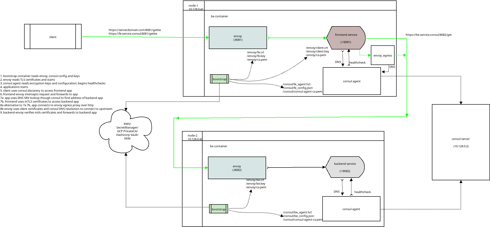
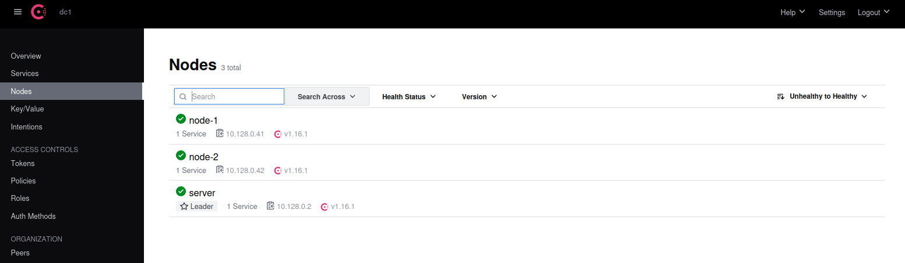
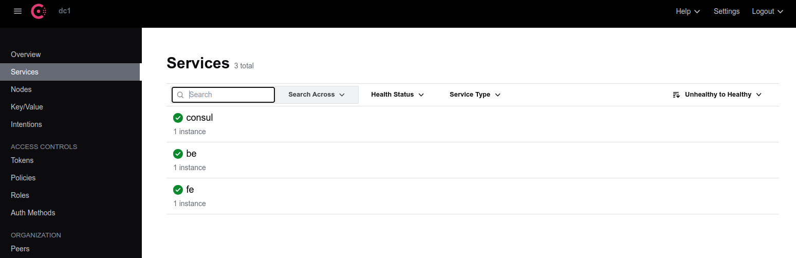

## Service->Service mTLS using Envoy and Consul Service Discovery on GCP Confidential Space

Tutorial demonstrating running [Consul](https://www.consul.io/) and `service->service mTLS` on GCP [Confidential Space](https://cloud.google.com/blog/products/identity-security/announcing-confidential-space).

Essentially, this demo will run a Consul Server and two Confidential Space containers acting as microservices.   Each microservice will register itself with the consul server and use its DNS resolution for service->service traffic. 

The service->service traffic is encrypted using mTLS certificates read in from GCP `Secret Manager`.

This repo is an implementation of the following:

- [Constructing Trusted Execution Environment (TEE) with GCP Confidential Space](https://github.com/salrashid123/confidential_space/blob/main/README.md#service-discovery-and-tee-tee-traffic)
- [mTLS proxy containers for GCP Confidential Compute](https://github.com/salrashid123/tee_server_proxy)


>> this repo is not supported by google


Note, this is a very, very  DIY "service mesh"  (and i use that term very loosely).  The challenge with running systems within confidential computing is each secret and constraint but be carefully released and even the TLS traffic's secrets should be secure (i.,e we 'just can't run istio/k8s' on confidential space).

This repo just happens to use consul and envoy and there are clearly alternatives to this mesh (envoy ofcourse has its own way to distribute secrets and coordinate service discovery...(i.,e istio))

---

In this demo, the consul server runs locally as a VM though in real life several replicas could run as a cluster in confidential space, remotely or hosted elsewhere.

Each mTLS certs/keys and consul agent/app configuration is are _pregenerated_ and saved hosted on `GCP Secret Manager` statically.  In real life, the certificates and keys could be generated preferably by private keys generated on each service instance and "signed" by  trusted authority (eg, Hashicorp Vault, GCP Private CA, etc).  That way the private keys only exist inside the service.   

For more information, see [mTLS using acquired Keys](https://github.com/salrashid123/confidential_space/blob/main/README.md#mtls-using-acquired-keys).  However, for simplicity, we are just going to pre-generate the certs and save them to secret manager.


At a high level, this setup includes several steps where each microservice container itself comprises of processes

1. `bootstrap`
   
   This is a small go application  which starts up first.  Its entire reason for being is to read certificates saved (in this case) from Secret Manager and launch envoy, consul and the actual service.  In real life, in stead of reading from Secret Manager using the ambient credentials (metadata credential), it should use the [confidential space JWT](https://github.com/salrashid123/confidential_space/blob/main/README.md#attestation-token-and-jwt-bearer-token) to access the backend system return mTLS keys and the consul configuration.

   Once the certificates and consul secrets are acquired, this binary will write them to specific folders where envoy and consul and find them.

   From there, the bootstrap container will launch consul, envoy and the actual service

2. `ingress/egress proxy (envoy)`

   All inbound traffic is to the container intercepted by an envoy proxy which, if configured will enforce mTLS.  The frontend service does not enforce mTLS but the second microservices does.
   
   If the frontend microservice needs to talk to another microservice, there are two ways to do this:   directly invoke the second microservice using mTLS certificates or use envoy as an egress https proxy.
   
   In the second case, envoy acts will use the client certificates and act as an https proxy for any local traffic intended for the backend.  Envoy in egress mode uses consul for DNS resolution.

3. `consul agent`

   Each node has a consul agent which receives its encryption and configuration keys from secret manager.

   This demo uses pregenerated consul node and application keys.  In real life, these would by dynamically generated as the node pool grows.

   Consul agent registers itself with the consul server and receives DNS updates for valid backend service addresses to connect to

4. `microservice`

   This is the backend application thats the actual microservice.

   The frontend microservice communicates with the backend in two ways:  
   
   - do a DNS lookup to consul, read mtls client certificates and invoke the endpoint
   - connect to envoy egress proxy and let envoy read the mtls certificates.  Envoy will use consul as the DNS server





Additional References:

- [Envoy Secret Distribution Service](https://github.com/salrashid123/envoy_control#3-sds-dynamic)
- [Envoy control plane "hello world"](https://github.com/salrashid123/envoy_control)
- [Envoy EDS "hello world"](https://github.com/salrashid123/envoy_discovery)
- [Envoy Dynamic Forward Proxy configuration with Downstream SNI for Google APIs and HTTPBin](https://github.com/salrashid123/envoy_dynamic_forward_proxy_with_sni)
- [Envoy mTLS](https://github.com/salrashid123/envoy_mtls)
- [gRPC xDS Loadbalancing](https://github.com/salrashid123/grpc_xds)
- [Secure service communication with Consul service mesh and Envoy](https://developer.hashicorp.com/consul/tutorials/developer-mesh/service-mesh-with-envoy-proxy?utm_source=docs)

---

### Setup

This repo comes with a consul server that is pre-configured with keys and config files for the server and agent.  IT also uses preset mTLS certificates for envoy. 

It will run a standalone consul server in an ordinary VM, then two confidential space instances where each instance is a microservice.

For the impatient, you can just run this on any project where you have a zone with a subnet of `10.128.0.0/20`

```bash
export OPERATOR_PROJECT_ID=`gcloud config get-value core/project`
export OPERATOR_PROJECT_NUMBER=`gcloud projects describe $OPERATOR_PROJECT_ID --format='value(projectNumber)'`

gcloud services enable  compute.googleapis.com confidentialcomputing.googleapis.com secretmanager.googleapis.com

gcloud projects add-iam-policy-binding $OPERATOR_PROJECT_ID   --member=serviceAccount:$OPERATOR_PROJECT_NUMBER-compute@developer.gserviceaccount.com    --role=roles/logging.logWriter

gcloud projects add-iam-policy-binding $OPERATOR_PROJECT_ID   --member=serviceAccount:$OPERATOR_PROJECT_NUMBER-compute@developer.gserviceaccount.com    --role=roles/confidentialcomputing.workloadUser

gcloud secrets create ca --replication-policy=automatic   --data-file=envoy/ca.pem
gcloud secrets create server-cert --replication-policy=automatic   --data-file=envoy/server.crt
gcloud secrets create server-key --replication-policy=automatic   --data-file=envoy/server.key

gcloud secrets create client-cert --replication-policy=automatic   --data-file=envoy/client.crt
gcloud secrets create client-key --replication-policy=automatic   --data-file=envoy/client.key

gcloud secrets create be-cert --replication-policy=automatic   --data-file=envoy/be.crt
gcloud secrets create be-key --replication-policy=automatic   --data-file=envoy/be.key

gcloud secrets create consul-agent-ca --replication-policy=automatic   --data-file=consul/consul-agent-ca.pem
gcloud secrets create fe_config --replication-policy=automatic   --data-file=consul/client_config_fe/fe_config.json
gcloud secrets create fe_agent-hcl --replication-policy=automatic   --data-file=consul/client_config_fe/fe_agent.hcl

gcloud secrets create be_agent-hcl --replication-policy=automatic   --data-file=consul/client_config_be/be_agent.hcl
gcloud secrets create be_config --replication-policy=automatic   --data-file=consul/client_config_be/be_config.json

## allow access to all secrets;  this is just a demo so we'e not even using workload federation no restricting which secrets which container (frontend/backend) should have access to
gcloud  projects add-iam-policy-binding $OPERATOR_PROJECT_ID --member=serviceAccount:$OPERATOR_PROJECT_NUMBER-compute@developer.gserviceaccount.com  --role=roles/secretmanager.secretAccessor 


gcloud compute instances create instance-1 --private-network-ip=10.128.0.2

gcloud compute ssh instance-1
#### install consul https://developer.hashicorp.com/consul/downloads
#### sudo apt-get install zip -y && wget https://releases.hashicorp.com/consul/1.16.1/consul_1.16.1_linux_amd64.zip && unzip consul_1.16.1_linux_amd64.zip && rm consul_1.16.1_linux_amd64.zip

git clone https://github.com/salrashid123/cs_systemd
cd cs_systemd/consul
consul agent  -config-file server_config/server.hcl -client 0.0.0.0  -bind 10.128.0.2 -advertise 10.128.0.2  -bootstrap-expect 1


gcloud compute ssh instance-1 -- -NL 8500:localhost:8500


# goto http://localhost:8500/ui/dc1/overview/server-status  and use TOKEN=7c4518b5-c944-0bc8-6d9e-508ec76e830a
```

At this point, we're ready to run the microservices in Confidential Space


```bash
## if you want to build these images by hand or 'just run' the images i setup here:
# docker build -f Dockerfile.fe -t docker.io/salrashid123/cs_fe .
# docker build -f Dockerfile.be -t docker.io/salrashid123/cs_be .

docker push docker.io/salrashid123/cs_fe
docker push docker.io/salrashid123/cs_be

gcloud compute instances create cs-2  --confidential-compute    \
     --shielded-secure-boot --tags=tee-vm  --private-network-ip=10.128.0.41  \
               --maintenance-policy=TERMINATE --service-account="$OPERATOR_PROJECT_NUMBER-compute@developer.gserviceaccount.com"   \
                         --scopes=cloud-platform  --zone=us-central1-a        \
                               --image-project=confidential-space-images --image-family=confidential-space-debug     \
                                           --metadata ^~^tee-image-reference=docker.io/salrashid123/cs_fe@sha256:7581f9ad07469c8076b2fc1db5619c9e6d3b548aa5ce436c17d1cd5a9457aa5a~tee-restart-policy=Never~tee-container-log-redirect=true


gcloud compute instances create cs-3  --confidential-compute    \
     --shielded-secure-boot --tags=tee-vm  --private-network-ip=10.128.0.42  \
               --maintenance-policy=TERMINATE --service-account="$OPERATOR_PROJECT_NUMBER-compute@developer.gserviceaccount.com"   \
                         --scopes=cloud-platform  --zone=us-central1-a        \
                               --image-project=confidential-space-images --image-family=confidential-space-debug     \
                                           --metadata ^~^tee-image-reference=docker.io/salrashid123/cs_be@sha256:3ee113dac1e06fc39fc7ad6af66026a37f48f3016cd488fbb9b0b5205a70da37~tee-restart-policy=Never~tee-container-log-redirect=true

# now ssh to instance-1 (the consul server)
curl -v --cacert envoy/ca.pem  --resolve  server.domain.com:8081:10.128.0.41  https://server.domain.com:8081/getfe
curl -v --cacert envoy/ca.pem  --resolve  server.domain.com:8081:10.128.0.41  https://server.domain.com:8081/getbe
```

You'll see mtls traffic to the first microservice

```bash
$ curl -v --cacert envoy/ca.pem  --resolve  server.domain.com:8081:10.128.0.41  https://server.domain.com:8081/getfe
* Added server.domain.com:8081:10.128.0.41 to DNS cache
* Hostname server.domain.com was found in DNS cache
*   Trying 10.128.0.41:8081...
* Connected to server.domain.com (10.128.0.41) port 8081 (#0)
* ALPN, offering h2
* ALPN, offering http/1.1
* successfully set certificate verify locations:
*  CAfile: envoy/ca.pem
*  CApath: /etc/ssl/certs
* TLSv1.3 (OUT), TLS handshake, Client hello (1):
* TLSv1.3 (IN), TLS handshake, Server hello (2):
* TLSv1.3 (IN), TLS handshake, Encrypted Extensions (8):
* TLSv1.3 (IN), TLS handshake, Certificate (11):
* TLSv1.3 (IN), TLS handshake, CERT verify (15):
* TLSv1.3 (IN), TLS handshake, Finished (20):
* TLSv1.3 (OUT), TLS change cipher, Change cipher spec (1):
* TLSv1.3 (OUT), TLS handshake, Finished (20):
* SSL connection using TLSv1.3 / TLS_AES_256_GCM_SHA384
* ALPN, server did not agree to a protocol
* Server certificate:
*  subject: C=US; O=Google; OU=Enterprise; CN=server.domain.com
*  start date: Aug 17 17:59:13 2022 GMT
*  expire date: Nov 24 17:59:13 2024 GMT
*  subjectAltName: host "server.domain.com" matched cert's "server.domain.com"
*  issuer: C=US; O=Google; OU=Enterprise; CN=Enterprise Subordinate CA
*  SSL certificate verify ok.
> GET /getfe HTTP/1.1
> Host: server.domain.com:8081
> User-Agent: curl/7.74.0
> Accept: */*

* TLSv1.3 (IN), TLS handshake, Newsession Ticket (4):
* TLSv1.3 (IN), TLS handshake, Newsession Ticket (4):
* old SSL session ID is stale, removing
* Mark bundle as not supporting multiuse
< HTTP/1.1 200 OK
< date: Tue, 19 Sep 2023 01:35:35 GMT
< content-length: 2
< content-type: text/plain; charset=utf-8
< x-envoy-upstream-service-time: 0
< server: envoy
< 

fe
```

and traffic to the backend from the first

```bash
$ curl -v --cacert envoy/ca.pem  --resolve  server.domain.com:8081:10.128.0.41  https://server.domain.com:8081/getbe
* Added server.domain.com:8081:10.128.0.41 to DNS cache
* Hostname server.domain.com was found in DNS cache
*   Trying 10.128.0.41:8081...
* Connected to server.domain.com (10.128.0.41) port 8081 (#0)
* ALPN, offering h2
* ALPN, offering http/1.1
* successfully set certificate verify locations:
*  CAfile: envoy/ca.pem
*  CApath: /etc/ssl/certs
* TLSv1.3 (OUT), TLS handshake, Client hello (1):
* TLSv1.3 (IN), TLS handshake, Server hello (2):
* TLSv1.3 (IN), TLS handshake, Encrypted Extensions (8):
* TLSv1.3 (IN), TLS handshake, Certificate (11):
* TLSv1.3 (IN), TLS handshake, CERT verify (15):
* TLSv1.3 (IN), TLS handshake, Finished (20):
* TLSv1.3 (OUT), TLS change cipher, Change cipher spec (1):
* TLSv1.3 (OUT), TLS handshake, Finished (20):
* SSL connection using TLSv1.3 / TLS_AES_256_GCM_SHA384
* ALPN, server did not agree to a protocol
* Server certificate:
*  subject: C=US; O=Google; OU=Enterprise; CN=server.domain.com
*  start date: Aug 17 17:59:13 2022 GMT
*  expire date: Nov 24 17:59:13 2024 GMT
*  subjectAltName: host "server.domain.com" matched cert's "server.domain.com"
*  issuer: C=US; O=Google; OU=Enterprise; CN=Enterprise Subordinate CA
*  SSL certificate verify ok.
> GET /getbe HTTP/1.1
> Host: server.domain.com:8081
> User-Agent: curl/7.74.0
> Accept: */*

* TLSv1.3 (IN), TLS handshake, Newsession Ticket (4):
* TLSv1.3 (IN), TLS handshake, Newsession Ticket (4):
* old SSL session ID is stale, removing
* Mark bundle as not supporting multiuse
< HTTP/1.1 200 OK
< date: Tue, 19 Sep 2023 01:35:38 GMT
< content-length: 7
< content-type: text/plain; charset=utf-8
< x-envoy-upstream-service-time: 12
< server: envoy
< 

be cs-3
```

If you had the consul admin console running, you'll see:

Nodes:


Services:



---

#### Run on VMs

If you want to run directly on VMs and not deal with confidential space (i.,e just to demo),

first create using the following `INTERNAL_IP` addresses:

```bash
$ gcloud compute instances list
NAME        ZONE           MACHINE_TYPE  PREEMPTIBLE  INTERNAL_IP  EXTERNAL_IP    STATUS
instance-1  us-central1-a  e2-medium                  10.128.0.2   34.172.77.225  RUNNING
cs-2        us-central1-a  e2-medium                  10.128.0.41  34.28.202.134  RUNNING
cs-2        us-central1-a  e2-small                   10.128.0.42  34.41.27.185   RUNNING

### start Consul Server

## ssh to instance-1
consul agent  -config-file server_config/server.hcl -client 0.0.0.0  -bind 10.128.0.2 -advertise 10.128.0.2  -bootstrap-expect 1

# to view the consul ui, in a new window
# export CONSUL_HTTP_TOKEN=7c4518b5-c944-0bc8-6d9e-508ec76e830a
#  gcloud compute ssh instance-1 -- -NL 8500:localhost:8500
# then goto http://localhost:8500/ui/dc1/overview/server-status
## use CONSUL_HTTP_TOKEN


### start Consul Client (node-1)
# on cs-2, install docker

docker build -f Dockerfile.fe -t fe .
docker run  -p 8081:8081 -p 8500:8500 -p 8500:8500/udp -p 8301:8301 -p 8301:8301/udp fe


### Consul Client (node-2)
# on cs-3, install docker
docker build -f Dockerfile.be -t be .
docker run  -p 8082:8082 -p 8500:8500 -p 8500:8500/udp -p 8301:8301 -p 8301:8301/udp be

### test service->service traffic on node-1
#### client->fe
curl -v --cacert envoy/ca.pem  --resolve  server.domain.com:8081:10.128.0.40  https://server.domain.com:8081/getfe
####  client->fe->be:
curl -v --cacert envoy/ca.pem  --resolve  server.domain.com:8081:10.128.0.40  https://server.domain.com:8081/getbe

## If you want to verify that node-1 can infact access the cosul apis
### get the running CONTAINER_ID
$ docker ps
CONTAINER ID   IMAGE     COMMAND                  CREATED         STATUS         
84d1ef7b46a0   fe        "/usr/bin/supervisord"   6 minutes ago   Up 6 minutes   0.0.0.0:8081->8081/tcp,    fervent_shannon

$ docker exec -ti 84d1ef7b46a0 /bin/bash

## in container:
apt-get install curl wget gettext-base

### get jwt login token for consul
cd /tmp/
wget https://raw.githubusercontent.com/salrashid123/consul_jwt_auth/main/acl/jwt.tmpl
export URL=https://idp-on-cloud-run-3kdezruzua-uc.a.run.app
export IAT=`date -u +%s`
export EXP=`date -u +%s -d "+3600 seconds"`
export EMAIL="operator-svc-account@vegas-codelab-5.iam.gserviceaccount.com"
export SUB="https://www.googleapis.com/compute/v1/projects/vegas-codelab-5/zones/us-central1-a/instances/vm1"
export ISS="https://confidentialcomputing.googleapis.com/"
export NAME="alice"
export AUD="https://sts.googleapis.com"
envsubst < "jwt.tmpl" > "jwt.json"
export JWT_TOKEN=`curl -s -X POST -d @jwt.json  $URL/token`
echo $JWT_TOKEN
echo -n $JWT_TOKEN > /tmp/jwt_token.txt

## use consul cli to login
/usr/local/bin/consul login -method=cs-jwt-auth -type=jwt -token-sink-file=/tmp/consul.token -bearer-token-file /tmp/jwt_token.txt -ca-file=/consul/consul-agent-ca.pem
/usr/local/bin/consul catalog nodes -service=fe -detailed -ca-file=/consul/consul-agent-ca.pem -token=`cat /tmp/consul.token`

## use ordinary dns on consul's port:

$ dig @127.0.0.1 -p 8600 fe.service.consul SRV

    ;; ANSWER SECTION:
    fe.service.consul.	0	IN	SRV	1 1 18081 node-1.node.dc1.consul.

    ;; ADDITIONAL SECTION:
    node-1.node.dc1.consul.	0	IN	A	10.128.0.41
    node-1.node.dc1.consul.	0	IN	TXT	"consul-version=1.16.1"
    node-1.node.dc1.consul.	0	IN	TXT	"consul-network-segment="


$ dig @127.0.0.1 -p 8600 be.service.consul SRV

    ;; ANSWER SECTION:
    be.service.consul.	0	IN	SRV	1 1 18082 node-2.node.dc1.consul.

    ;; ADDITIONAL SECTION:
    node-2.node.dc1.consul.	0	IN	A	10.128.0.42
    node-2.node.dc1.consul.	0	IN	TXT	"consul-network-segment="
    node-2.node.dc1.consul.	0	IN	TXT	"consul-version=1.16.1"
```

---

#### Setup full end-to-end

If you really want to set this  up and run this from scratch without using pregenerated consul config, there are a lot more steps.

You'll need to create the three vms' with the IP addresses specified.

On each vm install consul, envoy and golang

```bash

## create a new consul key
cd consul
$ consul keygen
  EYWAIfW4DqcblgN1PLQhZWF82mHekspKkgqIBU0ef40=

export CONSUL_KEY=EYWAIfW4DqcblgN1PLQhZWF82mHekspKkgqIBU0ef40=

# edit `server_config/server.hcl` and set your value of `$CONSUL_KEY`

rm -rf data/ data_agent/ consul-agent* dc1-*
consul tls ca create
consul tls cert create -server -dc dc1

consul agent  -config-file server_config/server.hcl -client 0.0.0.0  -bind 10.128.0.2 -advertise 10.128.0.2  -bootstrap-expect 1

# read SecretID as CONSUL_HTTP_TOKEN
$ consul acl 

      AccessorID:       2d0c2cec-25ae-c558-3d30-41339145d8c7
      SecretID:         7c4518b5-c944-0bc8-6d9e-508ec76e830a
      Description:      Bootstrap Token (Global Management)
      Local:            false
      Create Time:      2023-09-16 20:48:56.069149359 -0400 EDT
      Policies:
        00000000-0000-0000-0000-000000000001 - global-management

export CONSUL_HTTP_TOKEN=7c4518b5-c944-0bc8-6d9e-508ec76e830a

# use the key here
# to view the consul ui, in a new window
#  gcloud compute ssh instance-1 -- -NL 8500:localhost:8500
# then goto http://localhost:8500/ui/dc1/overview/server-status
## use CONSUL_HTTP_TOKEN


# read SecretID as export NODE_1_TOKEN=
$ consul acl token create -description "node-1 agent token"  -node-identity "node-1:dc1"
      AccessorID:       11a5156a-42e2-1ed3-2a97-82175816d148
      SecretID:         991a4761-c0ad-3314-c822-89900d53f84c
      Description:      node-1 agent token
      Local:            false
      Create Time:      2023-09-16 20:49:55.172203103 -0400 EDT
      Node Identities:
        node-1 (Datacenter: dc1)

# read SecretID as export NODE_2_TOKEN=
$ consul acl token create -description "node-1 agent token"  -node-identity "node-2:dc1"
      AccessorID:       28fbe6f7-0ef1-0ee6-0e59-1aa90f891504
      SecretID:         4de1d92f-9469-4348-09cc-4b0e4904e400
      Description:      node-1 agent token
      Local:            false
      Create Time:      2023-09-16 20:50:23.182768349 -0400 EDT
      Node Identities:
        node-2 (Datacenter: dc1)

export NODE_1_TOKEN=991a4761-c0ad-3314-c822-89900d53f84c
export NODE_2_TOKEN=4de1d92f-9469-4348-09cc-4b0e4904e400

consul acl policy create -name node-1-policy -rules @acl/node-1-policy.hcl
consul acl policy create -name node-2-policy -rules @acl/node-2-policy.hcl

consul acl policy create -name fe-policy -rules @acl/fe-policy.hcl
consul acl policy create -name be-policy -rules @acl/be-policy.hcl


consul acl token create -description "Token for fe" -service-identity "fe"
      AccessorID:       a8a46bd5-9807-2eb3-2046-b60792cbb448
      SecretID:         9befa2c2-a8ba-e145-f628-aa678a625cdc
      Description:      Token for fe
      Local:            false
      Create Time:      2023-09-16 20:52:07.512674558 -0400 EDT
      Service Identities:
        fe (Datacenters: all)

export APP_FE_TOKEN=9befa2c2-a8ba-e145-f628-aa678a625cdc

consul acl token create -description "Token for be" -service-identity "be"
      AccessorID:       c7bfb775-087c-4094-f667-cdaed4639f89
      SecretID:         85a7b172-d570-2a79-ff45-cfa58cea1f05
      Description:      Token for be
      Local:            false
      Create Time:      2023-09-16 20:52:38.934574596 -0400 EDT
      Service Identities:
        be (Datacenters: all)

export APP_BE_TOKEN=85a7b172-d570-2a79-ff45-cfa58cea1f05

consul acl policy create -name node-reader -rules @acl/node-reader.hcl

consul acl policy create -name anonymous-dns-read -rules @acl/anonymous-dns-read.hcl
consul acl token update -id anonymous -policy-name=anonymous-dns-read

consul acl role create -name "node-reader-role" -description "node-reader role" -policy-name "node-reader"
consul acl role create -name "node-1-role" -description "node role" -policy-name "node-1-policy"
consul acl role create -name "node-2-role" -description "node role" -policy-name "node-2-policy"

consul acl auth-method create -name=cs-jwt-auth -type jwt  -description 'conf space jwt' -config=@acl/cs-jwt-auth.json
consul acl binding-rule create -method=cs-jwt-auth -bind-type=role -bind-name=node-reader-role  -selector="value.swname==CONFIDENTIAL_SPACE and value.image_digest==\"sha256:c693f5cf4f447b31e8c0ae7f784fc754f783f2e64f8836913c22264004204f6b\" and value.swversion==1"


# on instance-2
##  edit client_config_fe/fe_agent.hcl and enter CONSUL_KEY as encrypt_key $NODE_1_TOKEN as acl.token.agent
##  edit client_config_fe/fe_config.json and enter APP_FE_TOKEN as service.token
# consul  agent   -config-dir=client_config_fe
docker build -f Dockerfile.fe -t fe .
docker run  -p 8081:8081 -p 8500:8500 -p 8500:8500/udp -p 8301:8301 -p 8301:8301/udp fe

# on instance-3
##  edit client_config_be/be_agent.hcl and enter CONSUL_KEY as encrypt_key $NODE_2_TOKEN as acl.token.agent
##  edit client_config_be/be_config.json and enter APP_BE_TOKEN as service.token
# consul  agent   -config-dir=client_config_be
docker build -f Dockerfile.be -t be .
docker run  -p 8082:8082 -p 8500:8500 -p 8500:8500/udp -p 8301:8301 -p 8301:8301/udp be

### test on instance-2

curl -v --cacert envoy/ca.pem  --resolve  server.domain.com:8081:10.128.0.41  https://server.domain.com:8081/

curl -v --cacert envoy/ca.pem  --resolve  server.domain.com:8081:10.128.0.41  https://server.domain.com:8081/getbe
```

for DNS lookups:

```bash
$ dig @127.0.0.1 -p 8600 fe.service.consul SRV

;; OPT PSEUDOSECTION:
; EDNS: version: 0, flags:; udp: 4096
;; QUESTION SECTION:
;fe.service.consul.		IN	SRV

;; ANSWER SECTION:
fe.service.consul.	0	IN	SRV	1 1 18081 node-1.node.dc1.consul.

;; ADDITIONAL SECTION:
node-1.node.dc1.consul.	0	IN	A	10.128.0.41
node-1.node.dc1.consul.	0	IN	TXT	"consul-version=1.16.1"
node-1.node.dc1.consul.	0	IN	TXT	"consul-network-segment="
```

```bash
$ dig @127.0.0.1 -p 8600 be.service.consul SRV

;; OPT PSEUDOSECTION:
; EDNS: version: 0, flags:; udp: 4096
;; QUESTION SECTION:
;be.service.consul.		IN	SRV

;; ANSWER SECTION:
be.service.consul.	0	IN	SRV	1 1 18082 node-2.node.dc1.consul.

;; ADDITIONAL SECTION:
node-2.node.dc1.consul.	0	IN	A	10.128.0.42
node-2.node.dc1.consul.	0	IN	TXT	"consul-network-segment="
node-2.node.dc1.consul.	0	IN	TXT	"consul-version=1.16.1"
```


